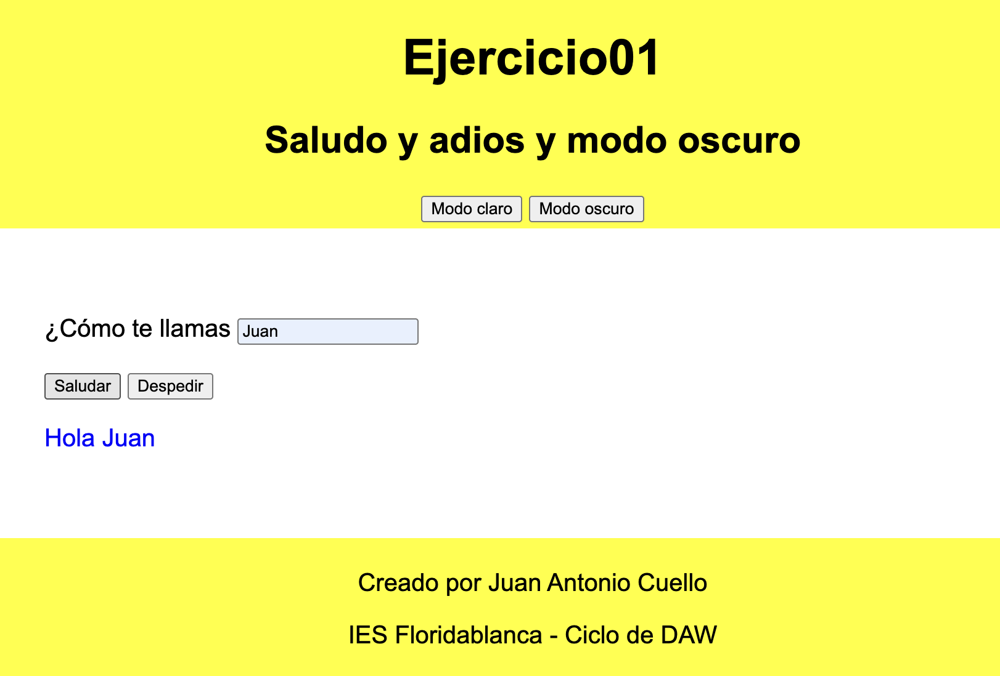
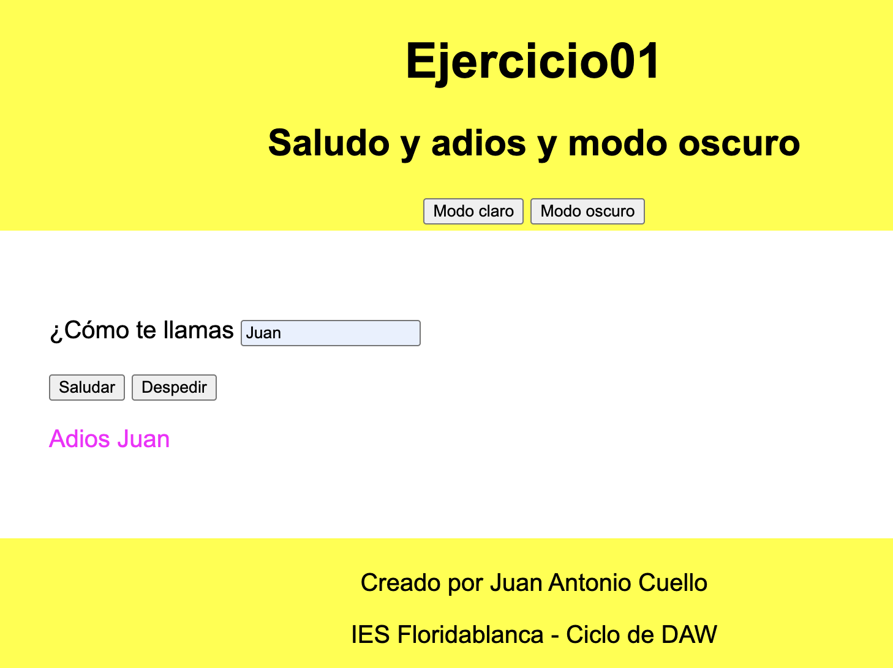

# EJERCICIO JAVASCRIPT Y DOM 
## 01 - Saludo y adios y modo oscuro

Crea un formulario para introducir tu nombre y un botón que al pulsarlo, muestre un saludo, es decir, muestre "Hola NOMBRE". El primer botón añadirá en el código html el evento *onclick()*

Añade un segundo botón que diga "Adios NOMBRE". Esta vez, usa un *listener* para añadir el evento al botón. 

OPCIONAL: Crea al principio dos botones para elegir entre modo claro y modo oscuro de la página. Para ello, aplica el estilo correspondiente al body.

### Indicaciones
- El archivo principal será index.html
- Usa estilos en una archivo separado
- Los script, antes de cerrar el `</body>` y en un archivo aparte `ejercicio01.js`

