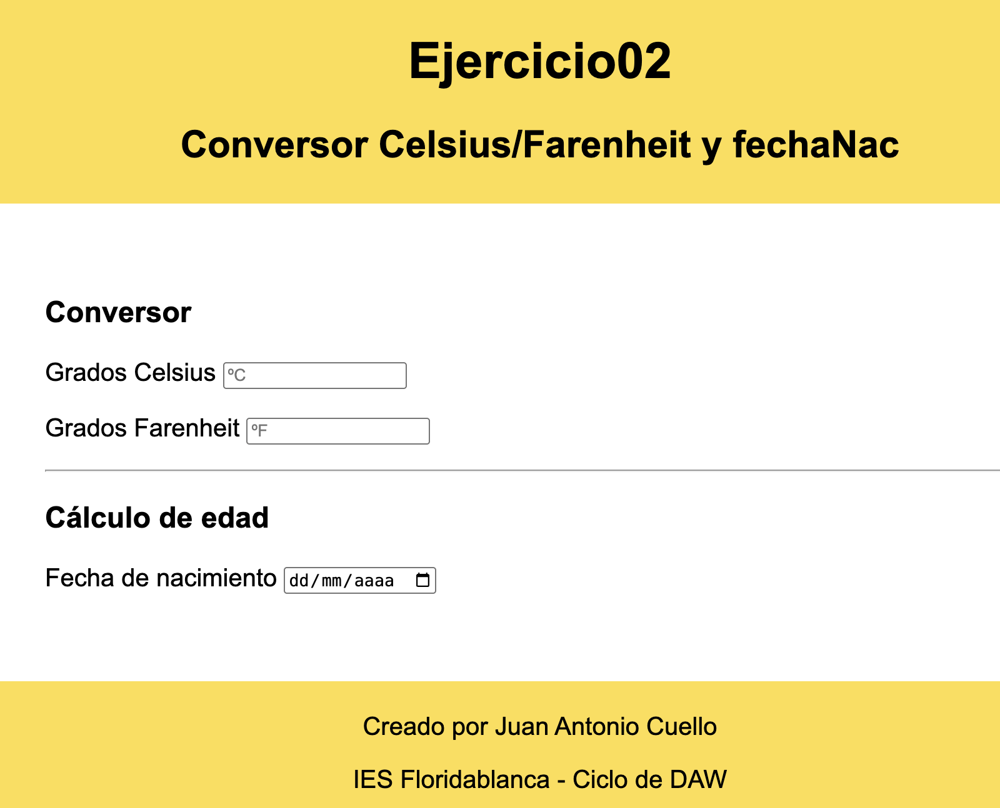
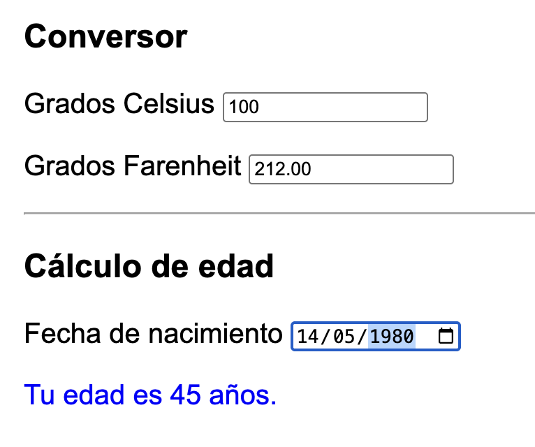

# EJERCICIO JAVASCRIPT Y DOM 
## 0X - Conversor Celsius/Farenheit y fechaNac
Parte1: Hacer un ejercicio que pase de grados celsius a ferenheit.  

Parte3: Indicar fecha nacimiento y decir la edad

### Indicaciones
- Para los input del conversor y el input de fecha, se hará dinamicamente, usando el evento `onInput`


```javascript
<input type="text" id="celsius" name="celsius" placeholder="ºC" oninput="nuevoValorCelsius()">
```




