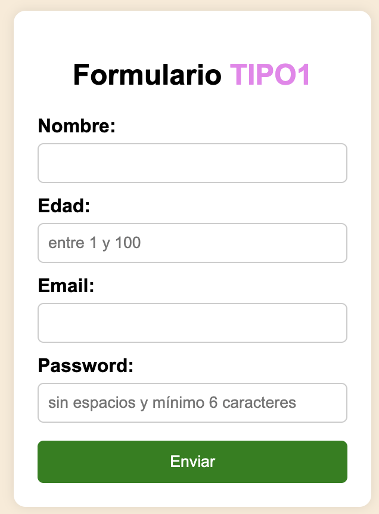
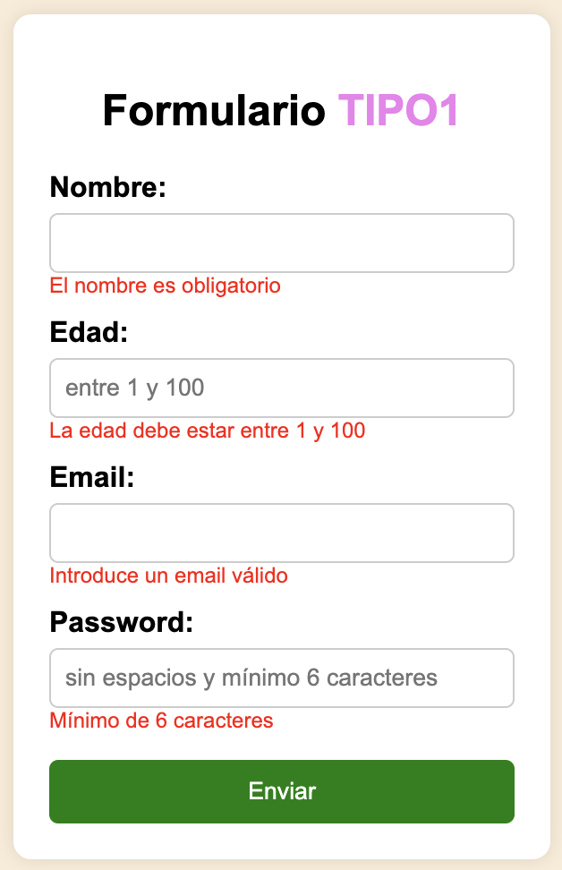

# EJERCICIO JAVASCRIPT Y DOM 
## 05 - Validar formulario 
Hacer un formulario como el de la imagen y validarlo con javascript. En las imágenes puedes ver las restricciones

### Indicaciones
- El email lo validaremos con el patrón 
`let emailRegex = /^[^\s@]+@[^\s@]+\.[^\s@]+$/;`

- Se usará `emailRegex.test(email)` para comprobar el patrón

