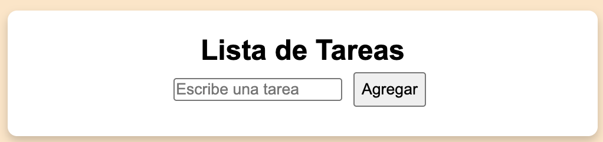
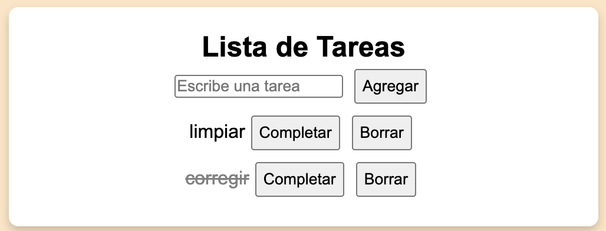

# EJERCICIO JAVASCRIPT Y DOM 
## 07 - toDO 
Hacer una aplicación sencilla para añadir tareas. 
Una vez añadida la tarea, se podrá borrar o completar.







### Indicaciones
- La lista de tareas sera una lista `ul`
- Completar la tarea pondra la tarea con los siguientes estilos:

```css
 .completada{
    text-decoration: line-through;
    color: gray;
 }
```
