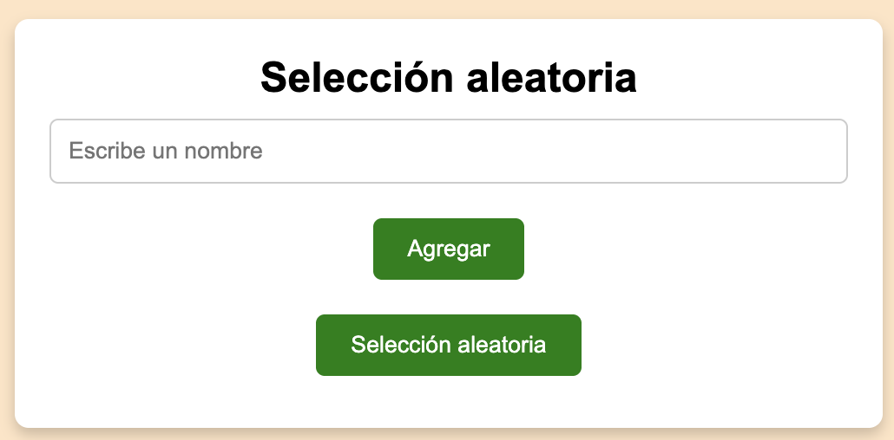
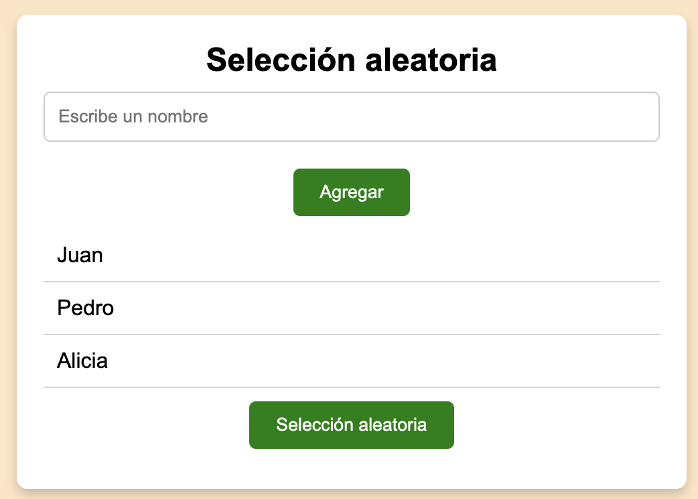
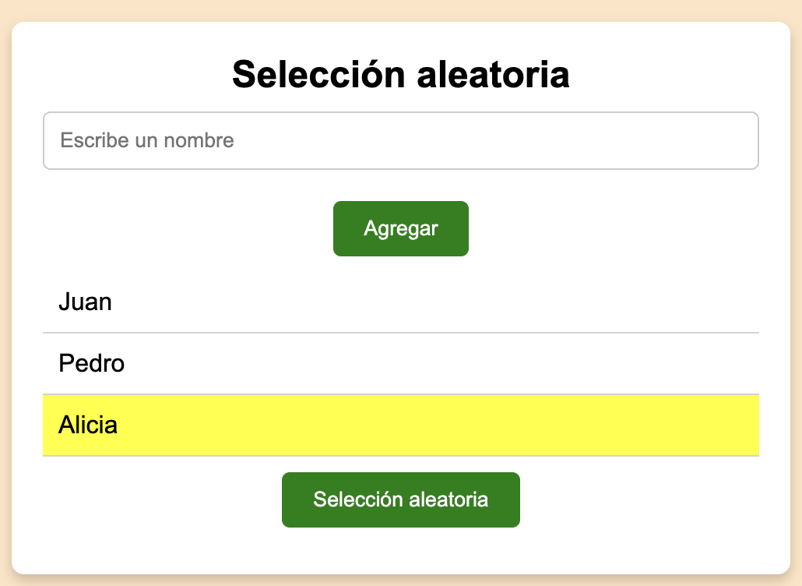

# EJERCICIO JAVASCRIPT Y DOM 
## 08 - Selección aleatoria 
Hacer un programa que permita añadir nombres a una lista.

Luego, con un botón, podremos escoger uno de ellos aleartoriamente. Le pondremos el fondo amarillo.









### Indicaciones
- La lista de nombres que vayamos añadiendo, se deberán guardar en un array `const nombres = [];`
- Para crear un numero aleatorio entre 0 y el total de elementos de la lista, usar
```javascript
const randomIndex = Math.floor(Math.random() * nombres.length);
```

- Para poder luego acceder a un elemento de la lista, al item `li`, puedes usar 

```javascript
//Acceso al item de la lista
const nombreLI = listaNombresUL.childNodes[randomIndex];
```

