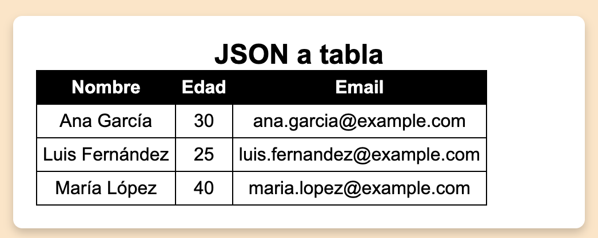

# EJERCICIO JAVASCRIPT Y DOM 
## 09 - Padar json a tabla 
Hacer un ejercicio que dado uno datos en JSON, los parsee y los convierta en una tabla html


NOTA: hay un script `como_se_recorre_json.js` que te explica como puedo recorrar un JSON sencillo.

Los datos JSON a parsear son:

```javascript
const personas = [
    {
      nombre: "Ana García",
      edad: 30,
      email: "ana.garcia@example.com"
    },
    {
      nombre: "Luis Fernández",
      edad: 25,
      email: "luis.fernandez@example.com"
    },
    {
      nombre: "María López",
      edad: 40,
      email: "maria.lopez@example.com"
    }
];
```





