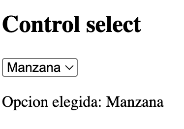

# EJERCICIO JAVASCRIPT Y DOM 
## 10 - Select HTML 
Rellenar un select dinamicamente con datos de un array. 

```javascript
 const frutas = ["Manzana","Pera","Fresa"];
```

Luego, al seleccionar un elemento, mostrarlo en un div.



